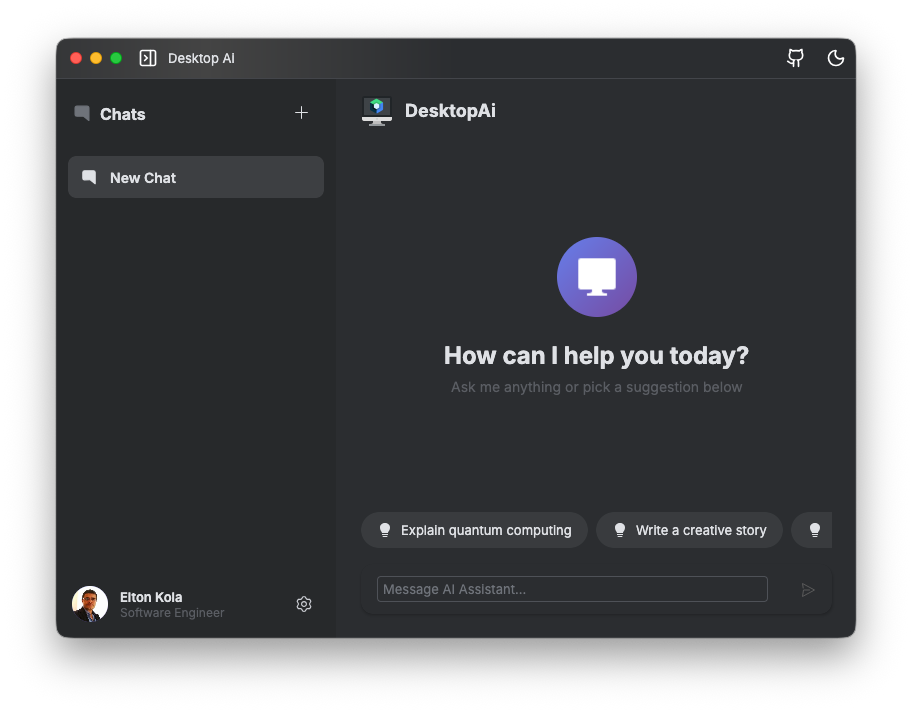
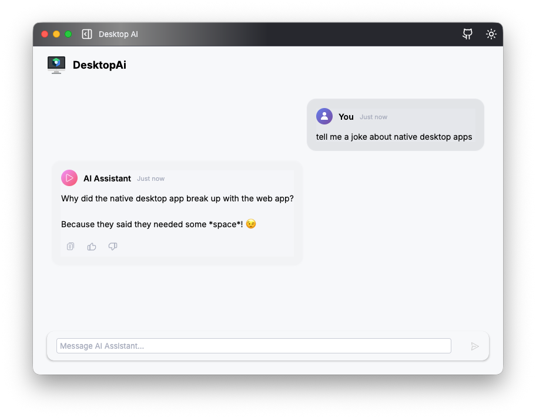

# Compose Desktop Template

A modern, cross-platform desktop application template built with Jetpack Compose Multiplatform.
I created it casue from time to time i create small desktop apps/utilities for personal use, and getting started is too much boildertemplate and copy paste.

## Screenshots


*Main application window*


*Application in action*

## Features

- 🖥️ Cross-platform support (Windows, macOS, Linux)
- 🎨 Modern UI with Jetpack Compose for Desktop
- 🏗️ CI/CD pipeline for automated builds
- 📦 Packaged as native installers for all platforms
- 🎨 Uses JetBrains Jewel UI components for a polished look
- 🔄 Hot reload for faster development

## Prerequisites

- JDK 17 or higher
- IntelliJ IDEA (recommended) or Android Studio
- Gradle 8.0 or higher

## Getting Started

1. Clone the repository
2. Open the project in IntelliJ IDEA or Android Studio
3. Run the application using the Gradle task: `run`

## Building

### Local Build

```bash
./gradlew package
```

### Create Distributables

```bash
./gradlew packageDmg        # macOS
./gradlew packageMsi        # Windows
./gradlew packageDeb        # Linux (Debian/Ubuntu)
```

## CI/CD

This project includes GitHub Actions workflow that automatically builds and packages the application for all major platforms:

- Windows (.msi)
- macOS (.dmg)
- Linux (.deb)

The workflow triggers on pushes to the `main` branch and on new releases.

## Dependencies

- Jetpack Compose Multiplatform
- JetBrains Jewel UI
- Ktor for networking
- Kotlinx Serialization
- SLF4J for logging

## Customize It

Feel free to:
- Remove libraries you don't need (like Ktor or ViewModel)
- Add new ones (like Koin or Coil)
- Create your own icons and replace the sample ones in the `icons` folder
  - Use services like [CloudConvert](https://cloudconvert.com/png-to-icns) to generate `.icns` and `.ico` files

## License

This project is licensed under the Apache License 2.0 - see the [LICENSE](LICENSE) file for details.
